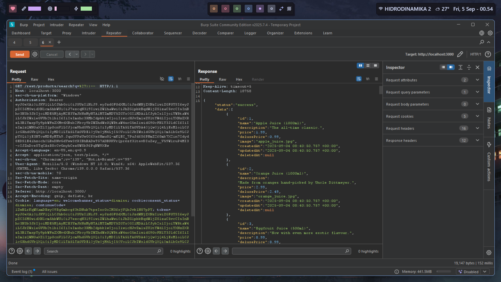
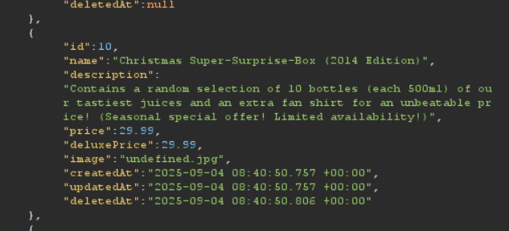
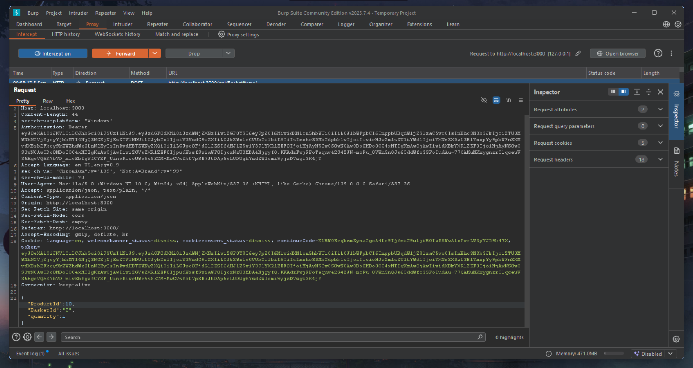
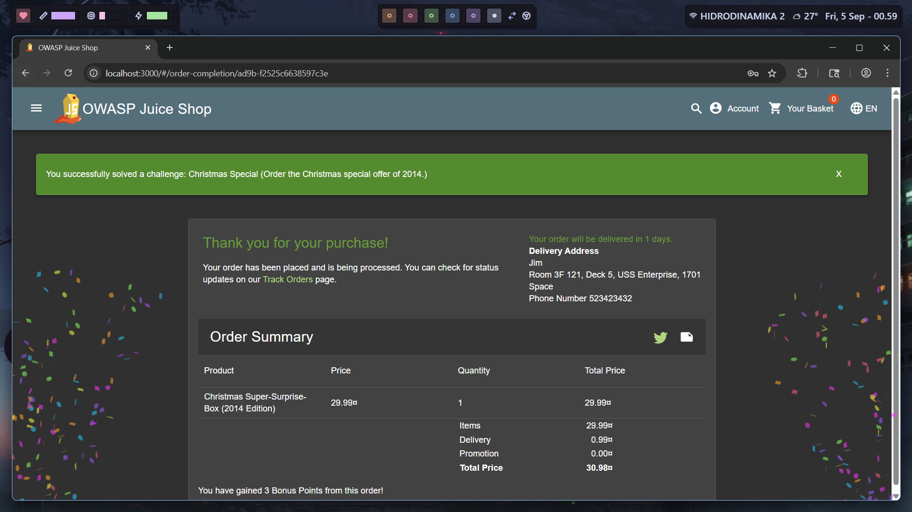

# Christmas Special

`https://pwning.owasp-juice.shop/companion-guide/latest/part1/running.html`

This challenge involves finding a special Christmas-themed product or feature on the OWASP Juice Shop. Let's explore the application to find Christmas-related content.

Browsing through the products, we can see various items. We need to look for something Christmas-related that might be hidden or special.

Looking at the product listings, we can see some interesting items. Let's check if there are any special or hidden Christmas products.

Found it! There's a Christmas Special product that appears to be available. This could be a seasonal item or a special promotional product.

Success! We've found the Christmas Special challenge solution by discovering the special Christmas-themed product in the catalog. This challenge demonstrates the importance of thorough enumeration and exploring all available products and features in a web application.