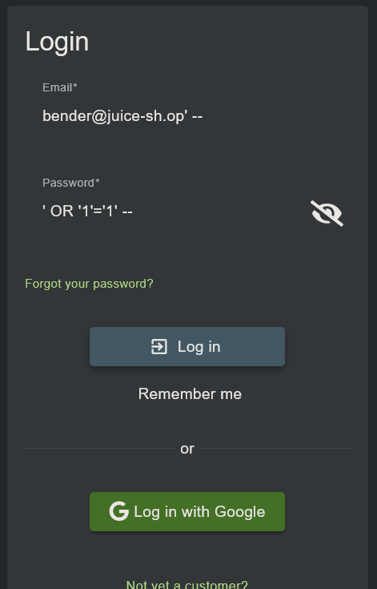
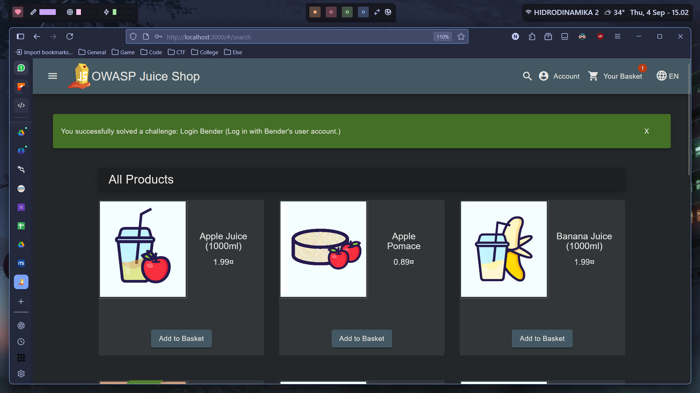
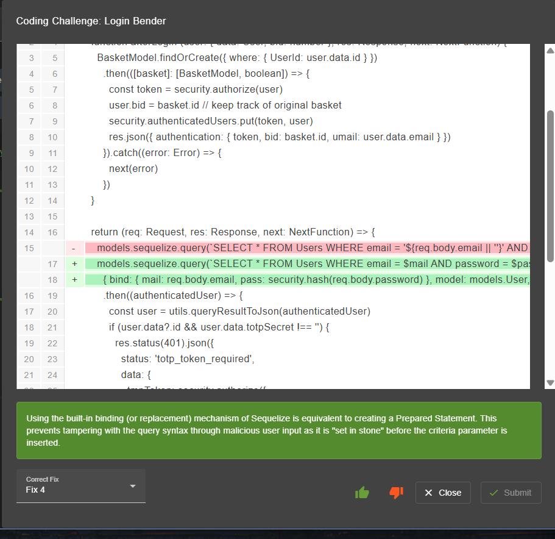

# Login Bender

```sql
' --
```






## Coding Challenge

```js
export function login () {
	  function afterLogin (user: { data: User, bid: number }, res: Response, next: NextFunction) {
	    BasketModel.findOrCreate({ where: { UserId: user.data.id } })
	      .then(([basket]: [BasketModel, boolean]) => {
	        const token = security.authorize(user)
	        user.bid = basket.id // keep track of original basket
	        security.authenticatedUsers.put(token, user)
	        res.json({ authentication: { token, bid: basket.id, umail: user.data.email } })
	      }).catch((error: Error) => {
	        next(error)
	      })
	  }
	 
	  return (req: Request, res: Response, next: NextFunction) => {
	    models.sequelize.query(`SELECT * FROM Users WHERE email = '${req.body.email || ''}' AND password = '${security.hash(req.body.password || '')}' AND deletedAt IS NULL`, { model: UserModel, plain: true })
	      .then((authenticatedUser) => {
	        const user = utils.queryResultToJson(authenticatedUser)
	        if (user.data?.id && user.data.totpSecret !== '') {
	          res.status(401).json({
	            status: 'totp_token_required',
	            data: {
	              tmpToken: security.authorize({
	                userId: user.data.id,
	                type: 'password_valid_needs_second_factor_token'
	              })
	            }
	          })
	        } else if (user.data?.id) {
	          afterLogin(user, res, next)
	        } else {
	          res.status(401).send(res.__('Invalid email or password.'))
	        }
	      }).catch((error: Error) => {
	        next(error)
	      })
	  }
```

Vuln:

```js
models.sequelize.query(`SELECT * FROM Users WHERE email = '${req.body.email || ''}' AND password = '${security.hash(req.body.password || '')}' AND deletedAt IS NULL`, { model: UserModel, plain: true })
```

