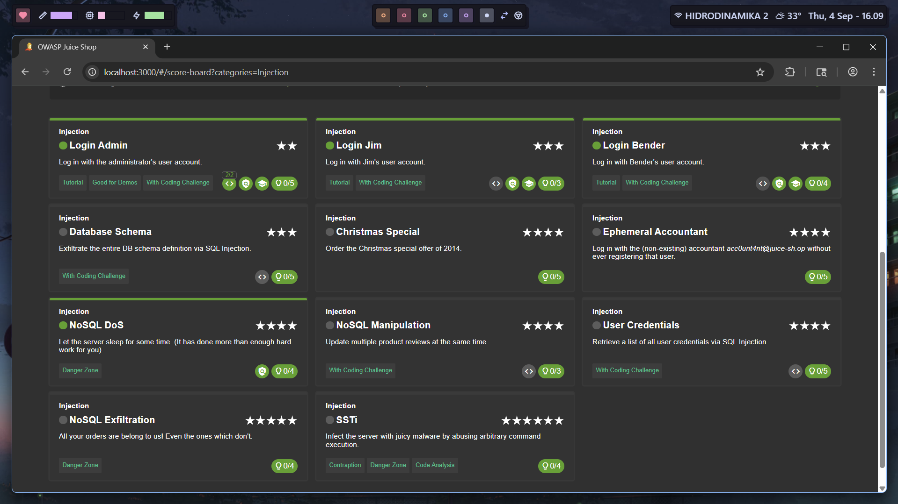

# NoSQL DoS

`https://pwning.owasp-juice.shop/companion-guide/latest/part1/running.html`

Pretty simple challenge, found the endpoint through intercepting and just changed the product id to `sleep(n)` and the challenge is done.

