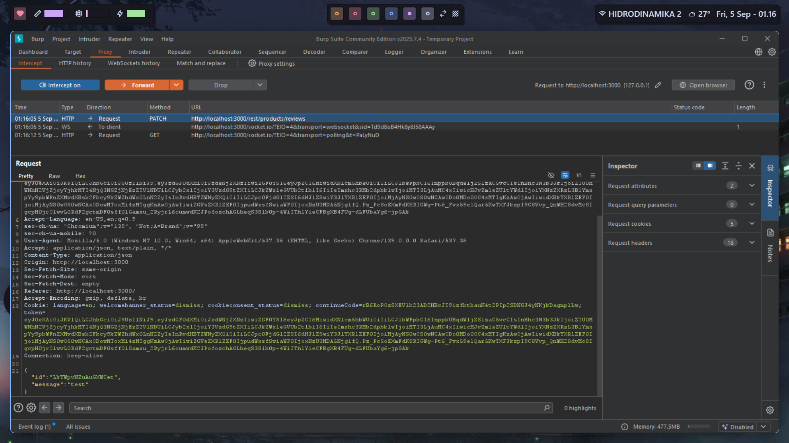
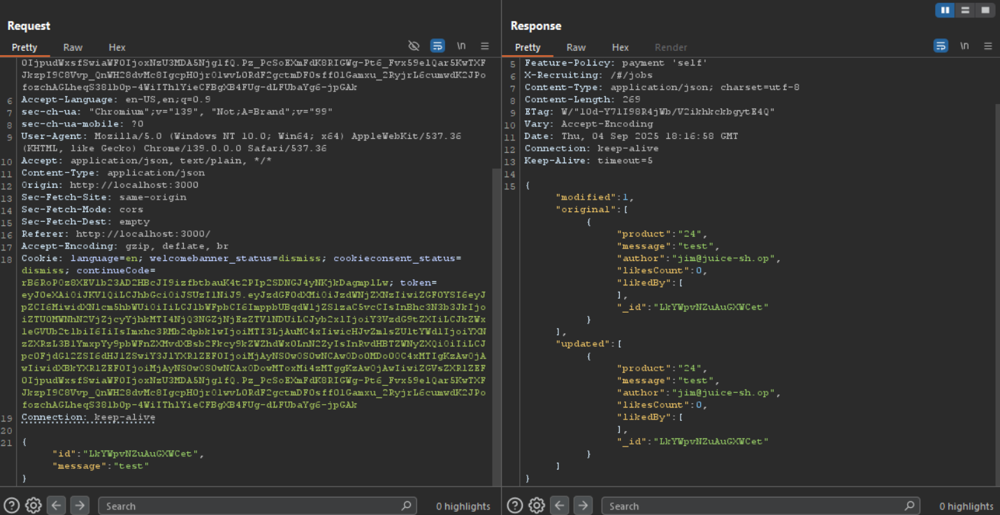
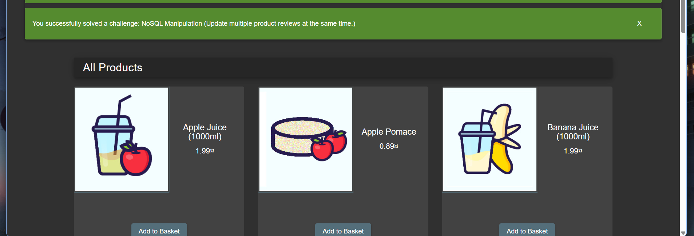

# NoSQL Manipulation

`https://pwning.owasp-juice.shop/companion-guide/latest/part1/running.html`

So we need to update all products reviews somehow with one request. After normally interacting with the site and using intercept, we get a peculiar request for updating a review:





So for this request to update multiple reviews at once, we can change the `id` parameter to `$ne` because it selects all the documents where the value is not equal to the specified value, so we can put null after to make the condition true for all entries.

```json
{
  "id": {"$ne": null},
  "message": "test"
}
```


