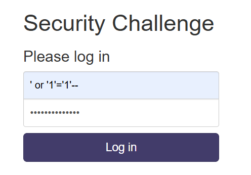

# More SQLi (PicoCTF)

`https://play.picoctf.org/practice/challenge/358`

```
Author: Mubarak Mikail
Description
Can you find the flag on this website. Try to find the flag here.
```


Blackbox challenge, I tried `test` for both fields and we are greeted with:


Vulnerable to normal auth SQLi.



After this we have a search function, which is using SQLite. I crafted a payload to to get the SQLite version:

`' UNION SELECT 1, sqlite_version(), 3;--`


So this is SQLite. We can get the table names by using the following payload:

`' UNION SELECT name, sql, null from sqlite_master;--`


There is a variable named flag in `more_table`, so we can just access that. Final payload:

`' UNION SELECT flag, null, null from more_table;--`


