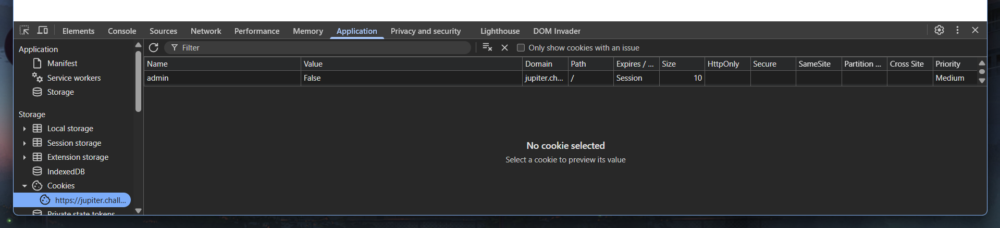

# logon (PicoCTF)

```
Author: bobson
Description
The factory is hiding things from all of its users. Can you login as Joe and find what they've been looking at? https://jupiter.challenges.picoctf.org/problem/15796/ (link) or http://jupiter.challenges.picoctf.org:15796
```

No source code, blackbox challenge.


Since there's nothing else on this site, we can try a common SQLi for login / auth bypass:

`' or '1'='1'--`


It seems like we can't get access to the Joe account this way, so I just tried using the same payload for the username field:


We logged in but there's no flag. This part is honestly a bit guessy, but I went to the devtools and see that the there's a cookie with the name admin and value set to `False`. So I just tried changing the value to `True` and we obtain the flag.




